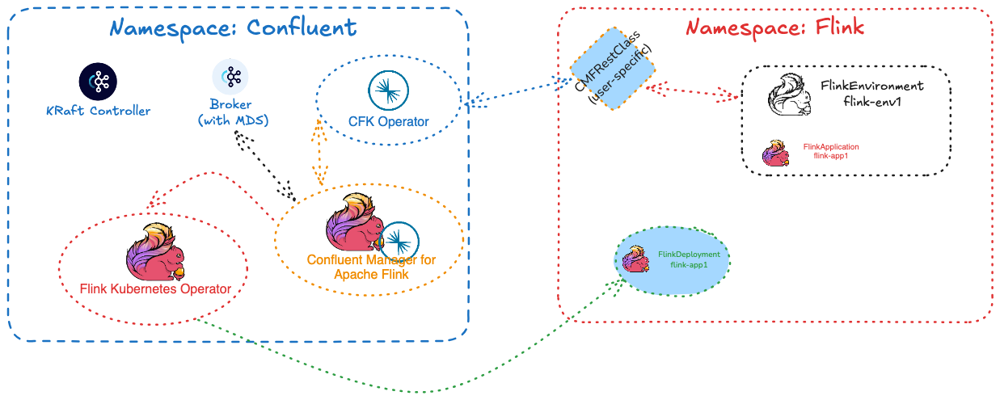
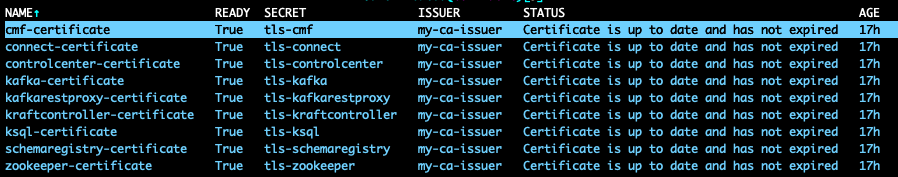
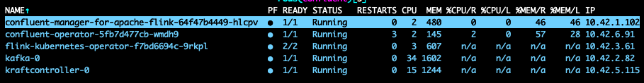
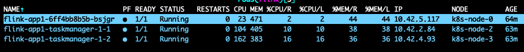

# CP Flink Examples and Playbook
Based on https://docs.confluent.io/platform/current/flink/get-started.html

* **cp-flink-infra** CP-Flink Infrastructure 
* **flink-applications** Example Applications (code - Table API, DataStream API etc.)
* **flink-deployments** Deployment examples (open-source FKO as well as Confluent FlinkEnvironment/FlinkApplication)

## Example Setup with RBAC and Flink Application (State Machine)
The following example setup can be deployed to test and demonstrate the different components of CP-Flink along with CP-RBAC authorization for different Flink usres (Sudo, Alice, Bob):

For better isolation in this example, we have added one separate namespace **flink** to run the Flink applications.
Steps to run the test/demo setup:
* Create certificates ([example with CertMan](./cp-flink-infra/certs/README.md))

* [Deploy Operators](./cp-flink-infra/RBAC-noLDAP/README.md) and then [Deploy CP-Flink Infrastructure](./cp-flink-infra/RBAC-noLDAP/README.md)

* [Deploy FlinkEnv and FlinkApp](./flink-deployments/README.md)

**Note:**
To separate different teams to use the same CP-Flink infrastructure, the Flink-Namespace-Setup should be extended to multiple namespaces for the Flink applications (e.g. one per team) with a team-specific **CMFRestClass** for each service-account within that namespace. Flink-permissions are set by **ConfluentRolebinding**-resource fo this service user. Access to the namespaces is managed on Kubernetes level.